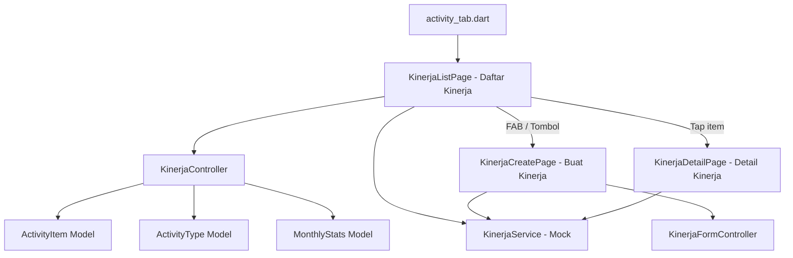
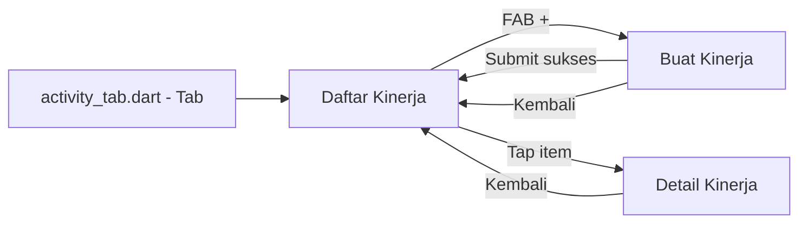
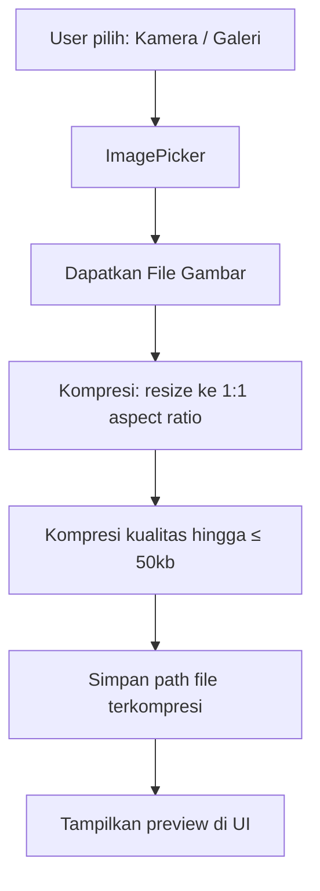
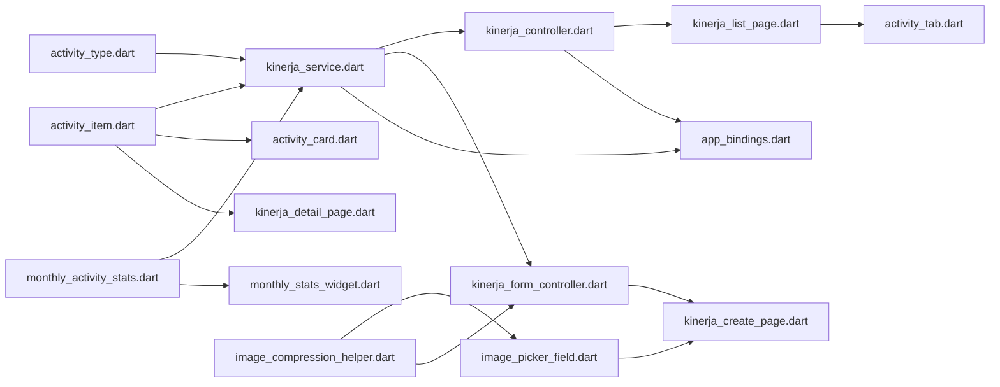

# Rencana Implementasi Halaman Kinerja (Activity)

## 1. Ringkasan

Membangun fitur **Kinerja** (labeling menggunakan istilah "Kinerja" bukan "Activity") yang terdiri dari 3 halaman:

1. **Daftar Kinerja** — List aktivitas dengan filter bulan, statistik bulanan, dan grup berdasarkan tanggal
2. **Buat Kinerja** — Form dengan pilih jenis kegiatan dari API, upload file/ambil kamera dengan kompresi max 50kb (1:1 aspect ratio)
3. **Detail Kinerja** — View detail aktivitas + lampiran gambar

> **Catatan:** API Service menggunakan mock data, mengikuti pola [`SubmissionService`](lib/features/submission/data/services/submission_service.dart) yang sudah ada.

---

## 2. Arsitektur & Struktur File

### 2.1 Structure Diagram



### 2.2 Struktur Folder

```
lib/features/kinerja/                      # Feature folder (label: Kinerja)
├── data/
│   ├── models/
│   │   ├── activity_item.dart             # Model item kinerja
│   │   ├── activity_type.dart             # Model jenis kegiatan
│   │   └── monthly_activity_stats.dart    # Model statistik bulanan
│   └── services/
│       └── kinerja_service.dart           # Abstract service + MockKinerjaService
├── presentation/
│   ├── controllers/
│   │   ├── kinerja_controller.dart        # Controller untuk list & stats
│   │   └── kinerja_form_controller.dart   # Controller untuk form create
│   └── pages/
│       ├── kinerja_list_page.dart         # Halaman daftar kinerja
│       ├── kinerja_create_page.dart       # Halaman buat kinerja
│       └── kinerja_detail_page.dart       # Halaman detail kinerja
```

> **Pola:** Folder dinamai `kinerja/` (bukan `activity/`) sesuai instruksi labeling. Tapi file Dart internal tetap gunakan `Activity` untuk class naming karena lebih lazim di kode.

---

## 3. Data Models

### 3.1 [`ActivityItem`](lib/features/kinerja/data/models/activity_item.dart)

```dart
class ActivityItem {
  final String id;
  final String typeId;
  final String typeName;
  final String description;
  final DateTime date;           // Tanggal kegiatan
  final String? imageUrl;        // Path/link gambar terkompresi
  final DateTime createdAt;
}
```

### 3.2 [`ActivityType`](lib/features/kinerja/data/models/activity_type.dart)

```dart
class ActivityType {
  final String id;
  final String name;              // Nama jenis kegiatan
  final String description;       // Deskripsi
  final IconData icon;            // Ikon representasi
}
```

### 3.3 [`MonthlyActivityStats`](lib/features/kinerja/data/models/monthly_activity_stats.dart)

```dart
class MonthlyActivityStats {
  final int totalActivities;               // Total aktivitas bulan ini
  final Map<String, int> activitiesByCategory;  // Per kategori
  final int target;                        // Target aktivitas bulanan
  final int month;                         // Bulan (1-12)
  final int year;                          // Tahun
}
```

---

## 4. Service & Mock Data

### 4.1 [`KinerjaService`](lib/features/kinerja/data/services/kinerja_service.dart)

```dart
abstract class KinerjaService {
  Future<List<ActivityType>> fetchTypes();
  Future<List<ActivityItem>> fetchActivities({required int month, required int year});
  Future<MonthlyActivityStats> fetchMonthlyStats({required int month, required int year});
  Future<ActivityItem> createActivity({
    required String typeId,
    required String description,
    String? imagePath,           // Path file gambar terkompresi
  });
}
```

### 4.2 Mock Data Strategy

Mengikuti pola [`MockSubmissionService`](lib/features/submission/data/services/submission_service.dart:22):

- Delay simulasi `600ms`
- Data jenis kegiatan statis (minimal 4-5 jenis kegiatan ASN seperti: `Kedinasan`, `Bimbingan Teknis`, `Rapat Koordinasi`, `Pelayanan Masyarakat`, `Lainnya`)
- Data aktivitas per bulan dengan variasi untuk testing filter
- Method `createActivity()` insert ke list internal seperti mock submission

---

## 5. Halaman Detail & Alur Navigasi

### 5.1 Navigation Flow



### 5.2 Perubahan pada [`activity_tab.dart`](lib/features/home/presentation/pages/tabs/activity_tab.dart:1)

File ini saat ini placeholder. Akan diubah menjadi:

```dart
class ActivityTab extends StatelessWidget {
  @override
  Widget build(BuildContext context) {
    return const KinerjaListPage();
  }
}
```

---

## 6. Halaman 1: Daftar Kinerja ([`kinerja_list_page.dart`](lib/features/kinerja/presentation/pages/kinerja_list_page.dart))

### 6.1 Layout

```
Scaffold
├── AppBar (custom) — dengan filter bulan di kanan
│   ├── Title: "Kinerja"
│   └── Action: Dropdown/TextButton filter bulan → popup pilih bulan
├── Body
│   ├── [Loading State] → Skeleton loader (AppSkeleton)
│   ├── [Error State] → AppErrorState
│   ├── [Empty State] → AppEmptyState + tombol "Buat Kinerja"
│   └── [Data State] → RefreshIndicator → SingleChildScrollView
│       ├── MonthlyStatsSection
│       │   ├── Card: Total Aktivitas (icon + count)
│       │   ├── Card: Aktivitas per Kategori (list chip/badge)
│       │   └── Card: Target Aktivitas (progress bar)
│       └── GroupedActivityList
│           └── Untuk setiap tanggal:
│               ├── DateHeader (format: "13 Mei 2026")
│               └── ActivityCard × N
└── FAB → navigate ke Buat Kinerja
```

### 6.2 Filter Bulan

- Menggunakan dropdown/button di AppBar yang menampilkan bulan saat ini
- Saat ditekan, tampilkan bottom sheet berisi 12 bulan (Januari-Desember)
- Hanya menampilkan aktivitas tahun berjalan (current year)
- Saat bulan berganti → reload data via controller

### 6.3 Monthly Stats Section

Menggunakan [`AppCard`](lib/design_system/components/app_card.dart) dengan variant outlined:

| Stat | Visual | Warna |
|------|--------|-------|
| Total Aktivitas | Ikon + angka besar | `colors.primary` |
| Per Kategori | List badge/chip per kategori dengan count | `colors.secondary` |
| Target | Progress bar (X/Y aktivitas) | `colors.primary` |

### 6.4 Grouped List

- Data difilter berdasarkan bulan yang dipilih
- Dikelompokkan (`groupBy`) berdasarkan tanggal
- Setiap grup memiliki header tanggal
- Setiap item memiliki card ringkas dengan:
  - Ikon jenis kegiatan
  - Nama jenis kegiatan
  - Deskripsi (1 line, ellipsis)
  - Indikator ada lampiran gambar
  - Tap → navigasi ke Detail Kinerja

---

## 7. Halaman 2: Buat Kinerja ([`kinerja_create_page.dart`](lib/features/kinerja/presentation/pages/kinerja_create_page.dart))

### 7.1 Layout

```
Scaffold
├── AppTopAppBar (withBack) — title: "Buat Kinerja"
└── Body — Form
    ├── Dropdown: Jenis Kegiatan (dari API mock)
    ├── TextField: Deskripsi kegiatan (multiline)
    ├── Image Upload Section
    │   ├── Jika belum ada gambar:
    │   │   └── 2 tombol: "Ambil Foto" + "Pilih dari Galeri"
    │   └── Jika sudah ada gambar:
    │       ├── Thumbnail preview 1:1
    │       ├── Info dimensi & ukuran file
    │       └── Tombol: Ganti / Hapus
    └── Button: "Simpan Kinerja"
```

### 7.2 Image Handling

**Flow upload & kompresi gambar:**



**Detail teknis kompresi:**

1. **Ambil gambar** via [`image_picker`](https://pub.dev/packages/image_picker) (perlu ditambahkan ke pubspec, atau bisa pakai [`camera`](https://pub.dev/packages/camera) yang sudah ada untuk kamera)
2. **Crop ke 1:1** — potong gambar menjadi persegi (ambil sisi terpendek sebagai referensi)
3. **Resize** — turunkan resolusi stepwise hingga ukuran file ≤ 50kb
4. **Simpan** — gunakan package [`image`](https://pub.dev/packages/image) (sudah ada di dependencies) untuk manipulasi

> **Catatan:** Package `image_picker` belum ada di pubspec. Perlu ditambahkan. Alternatif untuk kamera bisa menggunakan package `camera` yang sudah ada.

### 7.3 State Management

[`KinerjaFormController`](lib/features/kinerja/presentation/controllers/kinerja_form_controller.dart):

| Reactive Variable | Tipe | Deskripsi |
|---|---|---|
| `selectedType` | `Rx<ActivityType?>` | Jenis kegiatan terpilih |
| `descriptionCtrl` | `TextEditingController` | Controller deskripsi |
| `imagePath` | `Rx<String?>` | Path gambar terkompresi |
| `isLoading` | `RxBool` | Loading state submit |
| `formKey` | `GlobalKey<FormState>` | Validasi form |

**Method:**
- `pickImageFromCamera()` → ambil foto, kompres, set `imagePath`
- `pickImageFromGallery()` → pilih dari galeri, kompres, set `imagePath`
- `removeImage()` → reset `imagePath`
- `submit()` → validasi, panggil service, back + snackbar

### 7.4 Validasi

- Jenis kegiatan wajib dipilih
- Deskripsi wajib diisi (min 10 karakter)
- Gambar (opsional) — tidak wajib

---

## 8. Halaman 3: Detail Kinerja ([`kinerja_detail_page.dart`](lib/features/kinerja/presentation/pages/kinerja_detail_page.dart))

### 8.1 Layout

```
Scaffold
├── AppTopAppBar (withBack) — title: "Detail Kinerja"
└── Body — SingleChildScrollView
    ├── Image Section (jika ada lampiran)
    │   └── Gambar full-width dengan aspect ratio 1:1
    ├── Info Card (AppCard outlined)
    │   ├── Jenis Kegiatan (icon + nama)
    │   ├── Deskripsi (multiline)
    │   ├── Tanggal
    │   └── Dibuat pada (timestamp)
    └── [Actions] — optional (jika perlu edit/hapus)
```

### 8.2 Parameter

Menerima `ActivityItem` sebagai parameter (sama seperti [`SubmissionDetailPage`](lib/features/submission/presentation/pages/submission_detail_page.dart:14) menerima `SubmissionItem`).

---

## 9. Komponen Baru yang Perlu Dibuat

### 9.1 `ImagePickerField` — Widget reusable untuk upload gambar

- 2 opsi: Kamera & Galeri
- Preview thumbnail 1:1
- Informasi ukuran file
- Mengikuti pola [`AttachmentUploadField`](lib/features/submission/presentation/pages/widgets/attachment_upload_field.dart:7)

Letak: [`lib/features/kinerja/presentation/pages/widgets/image_picker_field.dart`](lib/features/kinerja/presentation/pages/widgets/image_picker_field.dart)

### 9.2 `ActivityCard` — Widget card untuk list item

- Ikon jenis kegiatan
- Nama jenis + deskripsi
- Indikator lampiran
- Navigasi ke detail

Letak: [`lib/features/kinerja/presentation/pages/widgets/activity_card.dart`](lib/features/kinerja/presentation/pages/widgets/activity_card.dart)

### 9.3 `MonthlyStatsWidget` — Widget statistik bulanan

- 3 card statistik (total, per kategori, target)
- Responsif

Letak: [`lib/features/kinerja/presentation/pages/widgets/monthly_stats_widget.dart`](lib/features/kinerja/presentation/pages/widgets/monthly_stats_widget.dart)

### 9.4 `ImageCompressionHelper` — Utility kompresi gambar

- Fungsi kompresi dengan target max 50kb
- Crop ke 1:1 aspect ratio
- Letak: [`lib/core/utils/image_compression_helper.dart`](lib/core/utils/image_compression_helper.dart)

---

## 10. Dependency Injection

### Perubahan pada [`AppBindings`](lib/core/di/app_bindings.dart:13)

Tambahkan:

```dart
// lib/features/kinerja/data/services/kinerja_service.dart
Get.put<KinerjaService>(MockKinerjaService(), permanent: true);
Get.put<KinerjaController>(
  KinerjaController(service: Get.find<KinerjaService>()),
  permanent: true,
);
```

---

## 11. Daftar Tugas (Todo List)

| # | Task | File Target | Dependensi |
|---|------|-------------|------------|
| 1 | **Buat model ActivityItem** | `lib/features/kinerja/data/models/activity_item.dart` | - |
| 2 | **Buat model ActivityType** | `lib/features/kinerja/data/models/activity_type.dart` | - |
| 3 | **Buat model MonthlyActivityStats** | `lib/features/kinerja/data/models/monthly_activity_stats.dart` | - |
| 4 | **Buat KinerjaService + MockKinerjaService** | `lib/features/kinerja/data/services/kinerja_service.dart` | Models 1-3 |
| 5 | **Buat ImageCompressionHelper** | `lib/core/utils/image_compression_helper.dart` | - |
| 6 | **Buat ImagePickerField widget** | `lib/features/kinerja/presentation/pages/widgets/image_picker_field.dart` | Helper 5 |
| 7 | **Buat ActivityCard widget** | `lib/features/kinerja/presentation/pages/widgets/activity_card.dart` | Model 1 |
| 8 | **Buat MonthlyStatsWidget** | `lib/features/kinerja/presentation/pages/widgets/monthly_stats_widget.dart` | Model 3 |
| 9 | **Buat KinerjaController** | `lib/features/kinerja/presentation/controllers/kinerja_controller.dart` | Service 4 |
| 10 | **Buat KinerjaFormController** | `lib/features/kinerja/presentation/controllers/kinerja_form_controller.dart` | Service 4, Helper 5 |
| 11 | **Buat KinerjaListPage** | `lib/features/kinerja/presentation/pages/kinerja_list_page.dart` | Controller 9, Widgets 7-8 |
| 12 | **Buat KinerjaCreatePage** | `lib/features/kinerja/presentation/pages/kinerja_create_page.dart` | FormController 10, Widget 6 |
| 13 | **Buat KinerjaDetailPage** | `lib/features/kinerja/presentation/pages/kinerja_detail_page.dart` | Model 1 |
| 14 | **Update ActivityTab placeholder** | `lib/features/home/presentation/pages/tabs/activity_tab.dart` | ListPage 11 |
| 15 | **Update AppBindings (DI)** | `lib/core/di/app_bindings.dart` | Service 4, Controller 9 |
| 16 | **Add dependency image_picker** | `pubspec.yaml` | - |

### Dependency Graph



### Urutan Implementasi yang Disarankan

1. **Models** (tasks 1-3) — no dependencies
2. **Service + Mock** (task 4) — depends on models
3. **ImageCompressionHelper** (task 5) — no dependencies
4. **Widgets** (tasks 6-8) — depends on models & helper
5. **Controllers** (tasks 9-10) — depends on service & helper
6. **Pages** (tasks 11-13) — depends on controllers & widgets
7. **Integration** (tasks 14-16) — depends on all above

---

## 12. Catatan Teknis

### 12.1 Image Compression Algorithm

```dart
Future<String?> compressImage(String sourcePath) async {
  final file = File(sourcePath);
  final image = decodeImage(await file.readAsBytes())!;
  
  // Step 1: Crop to 1:1 aspect ratio
  final size = min(image.width, image.height);
  final cropped = copyCrop(image, 
    x: (image.width - size) ~/ 2,
    y: (image.height - size) ~/ 2,
    width: size, 
    height: size,
  );
  
  // Step 2: Compress with quality adjustment
  int quality = 90;
  List<int> compressed;
  do {
    compressed = encodeJpg(cropped, quality: quality);
    quality -= 10;
  } while (compressed.length > 50 * 1024 && quality > 10);
  
  // Step 3: Save to temp file
  final outputPath = '${sourcePath}_compressed.jpg';
  await File(outputPath).writeAsBytes(compressed);
  return outputPath;
}
```

### 12.2 Package yang Mungkin Diperlukan

- [`image_picker`](https://pub.dev/packages/image_picker) — untuk pick dari galeri (perlu ditambahkan)
- [`image`](https://pub.dev/packages/image) — sudah ada di pubspec, untuk kompresi & crop
- [`camera`](https://pub.dev/packages/camera) — sudah ada di pubspec, bisa dipakai langsung untuk kamera

### 12.3 Design System yang Digunakan

| Komponen | Sumber |
|----------|--------|
| [`AppCard`](lib/design_system/components/app_card.dart) | Card untuk info & list item |
| [`AppButton`](lib/design_system/components/app_button.dart) | Tombol aksi |
| [`AppTextField`](lib/design_system/components/app_text_field.dart) | Input deskripsi |
| [`AppTopAppBar`](lib/design_system/components/organisms/app_top_app_bar.dart) | AppBar dengan back button |
| [`AppBottomSheet`](lib/design_system/components/organisms/app_bottom_sheet.dart) | Bottom sheet pilih bulan & pilih kamera/galeri |
| [`AppEmptyState`](lib/design_system/components/molecules/app_empty_state.dart) | Empty state |
| [`AppSkeleton`](lib/design_system/components/app_skeleton.dart) | Loading skeleton |
| [`AppChip`](lib/design_system/components/app_chip.dart) | Badge kategori |
| [`AppDropdown`](lib/design_system/components/app_dropdown.dart) | Dropdown jenis kegiatan |

### 12.4 Image Picker Library Decision

Saya perlu konfirmasi: apakah akan menggunakan `image_picker` (perlu ditambahkan) atau kombinasi `camera` (sudah ada) untuk kamera + mekanisme sendiri untuk galeri? **`image_picker`** adalah yang paling praktis karena handle kamera & galeri sekaligus.

---

## 13. Mock Data Detail

### Jenis Kegiatan (ActivityType)

| id | name | icon |
|----|------|------|
| `kedinasan` | Kegiatan Kedinasan | `work_history` |
| `bimtek` | Bimbingan Teknis | `school` |
| `rakor` | Rapat Koordinasi | `groups` |
| `pelayanan` | Pelayanan Masyarakat | `handshake` |
| `lainnya` | Kegiatan Lainnya | `assignment` |

### Contoh Data Aktivitas (per bulan)

```dart
// Mock data untuk bulan Mei 2026
[
  ActivityItem(id: 'k_1', typeId: 'kedinasan', typeName: 'Kegiatan Kedinasan',
      description: 'Menyusun laporan capaian kinerja triwulan II', 
      date: DateTime(2026, 5, 13), createdAt: DateTime(2026, 5, 13)),
  ActivityItem(id: 'k_2', typeId: 'rakor', typeName: 'Rapat Koordinasi',
      description: 'Rapat koordinasi lintas sektor program pembangunan',
      date: DateTime(2026, 5, 12), createdAt: DateTime(2026, 5, 12)),
  // ... lebih banyak data
]
```
