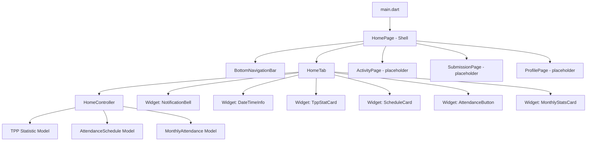
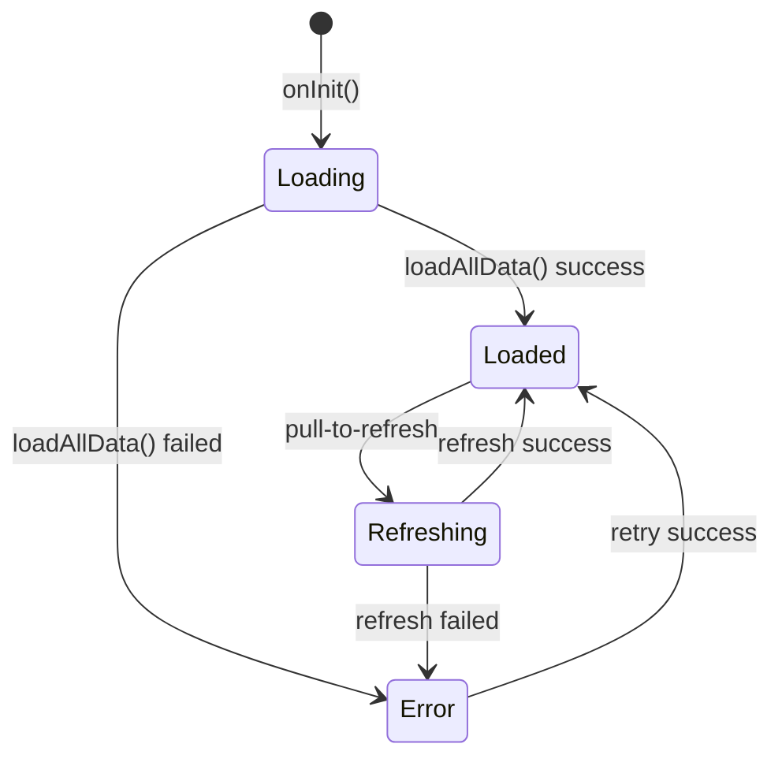
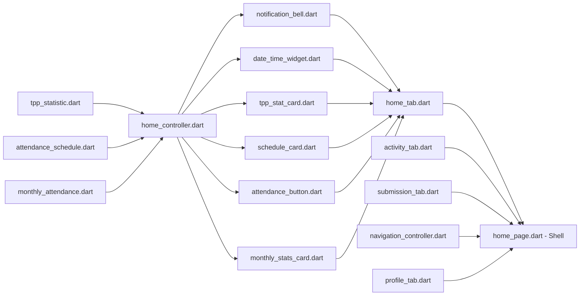

# Rencana Implementasi Home Page — Barru Presensi

## 1. Ringkasan

Membangun halaman utama (Home Page) aplikasi presensi dengan 4 tab navigasi: **Home**, **Activity**, **Submission**, dan **Profile**. Fokus awal adalah halaman Home yang berisi dashboard informasi presensi dan TPP.

---

## 2. Arsitektur & Struktur File

### 2.1 Structure Diagram



### 2.2 Struktur Folder

```
lib/features/home/
├── data/
│   └── models/
│       ├── tpp_statistic.dart
│       ├── attendance_schedule.dart
│       └── monthly_attendance.dart
├── presentation/
│   ├── controllers/
│   │   └── home_controller.dart
│   ├── pages/
│   │   ├── home_page.dart          # Shell navigasi utama dengan BottomNav
│   │   └── tabs/
│   │       ├── home_tab.dart        # Halaman Home dashboard
│   │       ├── activity_tab.dart    # Placeholder
│   │       ├── submission_tab.dart  # Placeholder
│   │       └── profile_tab.dart     # Placeholder
│   └── widgets/
│       ├── notification_bell.dart
│       ├── date_time_widget.dart
│       ├── tpp_stat_card.dart
│       ├── schedule_card.dart
│       ├── attendance_button.dart
│       └── monthly_stats_card.dart
```

> **Catatan**: Model-model data ditempatkan di sub-folder `data/models/` untuk memisahkan concern data dari UI. Ini mengikuti pola yang umum pada proyek Flutter dengan GetX.

---

## 3. Data Models

### 3.1 TPP Statistic — [`lib/features/home/data/models/tpp_statistic.dart`]

```dart
class TppStatistic {
  final double totalAmount;     // Jumlah besaran TPP
  final double totalDeduction;  // Total potongan
  final double netResult;       // Hasil potongan (totalAmount - totalDeduction)
  final String period;          // Periode (contoh: "Mei 2026")
}
```

### 3.2 Attendance Schedule — [`lib/features/home/data/models/attendance_schedule.dart`]

```dart
enum ScheduleStatus { active, dayOff, submitted, noSchedule }

class AttendanceSchedule {
  final String? shiftName;       // Nama shift (contoh: "Pagi", "Sore")
  final String? checkInTime;     // Jam masuk (contoh: "07:30")
  final String? checkOutTime;    // Jam pulang (contoh: "16:00")
  final ScheduleStatus status;   // Status jadwal hari ini
  final String? message;         // Pesan tambahan (misal: "Hari Libur Nasional")
}
```

### 3.3 Monthly Attendance — [`lib/features/home/data/models/monthly_attendance.dart`]

```dart
class MonthlyAttendance {
  final int present;      // Hadir
  final int permission;   // Izin
  final int leave;        // Cuti
  final int absent;       // Alpha/Tanpa Keterangan
  final int total;        // Total hari kerja dalam bulan ini
  final String month;     // Nama bulan (contoh: "Mei 2026")
}
```

---

## 4. State Management — HomeController

Menggunakan **GetX Controller** dengan reactive variables (`Rx`). Controller ini akan mengelola:

| Reactive Variable | Tipe | Deskripsi |
|---|---|---|
| `currentDateTime` | `Rx<DateTime>` | Waktu real-time (diupdate tiap detik) |
| `unreadNotifications` | `RxInt` | Jumlah notifikasi belum dibaca |
| `tppStatistic` | `Rx<TppStatistic>` | Data statistik TPP |
| `schedule` | `Rx<AttendanceSchedule?>` | Jadwal presensi hari ini |
| `attendanceStatus` | `Rx<AttendanceStatus>` | Status presensi saat ini |
| `monthlyAttendance` | `Rx<MonthlyAttendance>` | Statistik bulanan |
| `isLoading` | `RxBool` | Status loading data |
| `errorMessage` | `RxString?` | Pesan error jika ada |

**Enum `AttendanceStatus`**: `checkIn, break_, breakReturn, checkOut, completed`

**Method-method:**

| Method | Deskripsi |
|---|---|
| `onInit()` | Inisialisasi: mulai timer jam, load semua data |
| `loadAllData()` | Fetch data TPP, jadwal, statistik dari API/mock |
| `onAttendancePressed()` | Handler tombol presensi dinamis |
| `refreshData()` | Pull-to-refresh semua data |

**Alur State:**



---

## 5. Komponen Widget Home Tab

### 5.1 Layout Utama ([`home_tab.dart`])

```
SafeArea ─> RefreshIndicator ─> SingleChildScrollView
  └── Column
      ├── NotificationBell + DateTimeInfo (Header row)
      ├── AttendanceStatusCard (jam + status presensi)
      ├── TppStatCard (statistik TPP)
      ├── ScheduleCard (jadwal hari ini)
      ├── AttendanceButton (tombol presensi dinamis)
      └── MonthlyStatsCard (statistik bulanan)
```

### 5.2 Detail Setiap Widget

#### a. Header — [`notification_bell.dart`]
- Icon bell dengan badge unread count
- Menggunakan komponen `Stack` + `Positioned` untuk badge

#### b. Header — [`date_time_widget.dart`]
- Menampilkan hari, tanggal, dan jam real-time
- Update setiap detik via `Timer.periodic` di controller
- Format: "Rabu, 13 Mei 2026 • 10:24:15"

#### c. TPP Stat Card — [`tpp_stat_card.dart`]
- Menggunakan komponen [`AppCard`](lib/design_system/components/app_card.dart)
- 3 baris informasi: **Jumlah Besaran**, **Potongan**, **Hasil Potongan**
- Gunakan warna `colors.success` untuk hasil positif, `colors.error` untuk negatif
- Tampilkan periode TPP di bagian atas

#### d. Schedule Card — [`schedule_card.dart`]
- Menampilkan jadwal shift hari ini (nama shift, jam masuk-pulang)
- Jika tidak ada jadwal: tampilkan pesan sesuai status (`dayOff`, `submitted`, `noSchedule`)
- Gunakan ikon yang berbeda untuk setiap status

#### e. Attendance Button — [`attendance_button.dart`]
- Tombol besar di tengah layar
- **Dinamis** berubah berdasarkan status:
  - `checkIn` → "Presensi Masuk" (icon login)
  - `break_` → "Mulai Istirahat" (icon free_breakfast)
  - `breakReturn` → "Kembali dari Istirahat" (icon restart_alt)
  - `checkOut` → "Presensi Pulang" (icon logout)
  - `completed` → "Presensi Selesai" (icon check_circle, disabled)
- Gunakan komponen [`AppButton`](lib/design_system/components/app_button.dart) atau styling khusus
- Animasi transisi antar status
- Loading state saat memproses

#### f. Monthly Stats Card — [`monthly_stats_card.dart`]
- Menampilkan 4 bar statistik: **Hadir**, **Izin**, **Cuti**, **Alpha**
- Format: "Hadir    20 / 24 hari"
- Gunakan progress bar/indikator visual dengan warna berbeda:
  - Hadir: `colors.success`
  - Izin: `colors.warning`
  - Cuti: `colors.primary`
  - Alpha: `colors.error`
- Judul card: nama bulan

---

## 6. Navigasi — Shell Page

### 6.1 HomePage ([`home_page.dart`])

Halaman `HomePage` di-refactor menjadi **shell navigasi** yang berisi:

```dart
class HomePage extends StatelessWidget {
  // ...
  // Menggunakan IndexedStack untuk menjaga state tiap tab
  // BottomNavigationBar dengan AppBottomNavBar (existing component)
  // Controller untuk navigasi (NavigationController sederhana)
}
```

### 6.2 Tab Items

| Tab | Icon | Label | Halaman |
|---|---|---|---|
| 0 | `Icons.home_rounded` | Home | [`home_tab.dart`] |
| 1 | `Icons.history_rounded` | Activity | [`activity_tab.dart`] |
| 2 | `Icons.upload_file_rounded` | Submission | [`submission_tab.dart`] |
| 3 | `Icons.person_rounded` | Profile | [`profile_tab.dart`] |

### 6.3 NavigationController

Controller sederhana untuk mengelola index tab aktif:

```dart
class NavigationController extends GetxController {
  final currentIndex = 0.obs;
  void changeIndex(int index) => currentIndex.value = index;
}
```

---

## 7. Integrasi dengan Existing Code

### 7.1 Perubahan pada `main.dart`
- Tidak ada perubahan pada entry point
- HomePage tetap menjadi tujuan setelah login

### 7.2 Perubahan pada `AuthController`
- Tidak ada perubahan, karena navigasi ke HomePage sudah benar

### 7.3 Mock Data (Sementara)
Karena backend belum terintegrasi, semua data akan menggunakan **mock/offline data** yang didefinisikan langsung di controller. Ini memudahkan testing dan demo.

```dart
// Contoh mock data di HomeController
void _loadMockData() {
  tppStatistic.value = TppStatistic(
    totalAmount: 5_000_000,
    totalDeduction: 750_000,
    netResult: 4_250_000,
    period: 'Mei 2026',
  );
  schedule.value = AttendanceSchedule(
    shiftName: 'Pagi',
    checkInTime: '07:30',
    checkOutTime: '16:00',
    status: ScheduleStatus.active,
  );
  monthlyAttendance.value = MonthlyAttendance(
    present: 18,
    permission: 2,
    leave: 1,
    absent: 0,
    total: 22,
    month: 'Mei 2026',
  );
}
```

---

## 8. Daftar Tugas (Todo List)

| # | Task | File Target | Ketergantungan |
|---|---|---|---|
| 1 | **Buat HomeController** dengan GetX, state, dan mock data | `lib/features/home/presentation/controllers/home_controller.dart` | - |
| 2 | **Buat NavigationController** untuk bottom nav | `lib/features/home/presentation/controllers/navigation_controller.dart` | - |
| 3 | **Buat model TppStatistic** | `lib/features/home/data/models/tpp_statistic.dart` | - |
| 4 | **Buat model AttendanceSchedule** & enum ScheduleStatus | `lib/features/home/data/models/attendance_schedule.dart` | - |
| 5 | **Buat model MonthlyAttendance** | `lib/features/home/data/models/monthly_attendance.dart` | - |
| 6 | **Buat widget NotificationBell** | `lib/features/home/presentation/widgets/notification_bell.dart` | `home_controller` |
| 7 | **Buat widget DateTimeInfo** (jam & tanggal real-time) | `lib/features/home/presentation/widgets/date_time_widget.dart` | `home_controller` |
| 8 | **Buat widget TppStatCard** (3 baris info TPP) | `lib/features/home/presentation/widgets/tpp_stat_card.dart` | `model`, `home_controller` |
| 9 | **Buat widget ScheduleCard** (jadwal hari ini) | `lib/features/home/presentation/widgets/schedule_card.dart` | `model`, `home_controller` |
| 10 | **Buat widget AttendanceButton** (tombol dinamis) | `lib/features/home/presentation/widgets/attendance_button.dart` | `model`, `home_controller` |
| 11 | **Buat widget MonthlyStatsCard** (statistik bulanan) | `lib/features/home/presentation/widgets/monthly_stats_card.dart` | `model`, `home_controller` |
| 12 | **Buat HomeTab** (gabungan semua widget dalam scroll) | `lib/features/home/presentation/pages/tabs/home_tab.dart` | Semua widget di atas |
| 13 | **Buat placeholder tabs** (Activity, Submission, Profile) | `lib/features/home/presentation/pages/tabs/activity_tab.dart` | - |
| 14 | **Refactor HomePage** menjadi shell dengan BottomNav + IndexedStack | `lib/features/home/presentation/pages/home_page.dart` | Semua tab pages |
| 15 | **Update `main.dart`** jika perlu routing adjustments | `lib/main.dart` | Task 14 |

### Dependency Graph



### Urutan Implementasi yang Disarankan

1. **Models** (tasks 3-5) → tidak dependen, bisa dikerjakan duluan
2. **Controllers** (tasks 1-2) → dependen pada models
3. **Widgets** (tasks 6-11) → dependen pada controller & models
4. **Tab pages** (tasks 12-13) → dependen pada widgets
5. **Shell page** (task 14) → dependen pada semua tab pages
6. **Final check** (task 15)

---

## 9. Catatan Teknis

- Gunakan **GetX reactive** (`Rx` / `obs`) untuk semua state yang berubah
- Semua komponen UI harus mendukung **light & dark mode** via `Theme.of(context).extension<AppColors>()`
- Gunakan `flutter_screenutil` (`.w`, `.h`, `.r`) untuk responsive sizing
- Manfaatkan komponen existing [`AppCard`](lib/design_system/components/app_card.dart), [`AppButton`](lib/design_system/components/app_button.dart), [`AppSkeleton`](lib/design_system/components/app_skeleton.dart)
- Gunakan [`AppBottomNavBar`](lib/design_system/components/app_bottom_nav_bar.dart) yang sudah tersedia
- Semua string label menggunakan Bahasa Indonesia
- Timer untuk jam real-time harus di-`dispose` di `onClose()` untuk mencegah memory leak
- Untuk animation pada tombol presensi, gunakan `AnimatedContainer` atau `AnimatedSwitcher` dari design system
