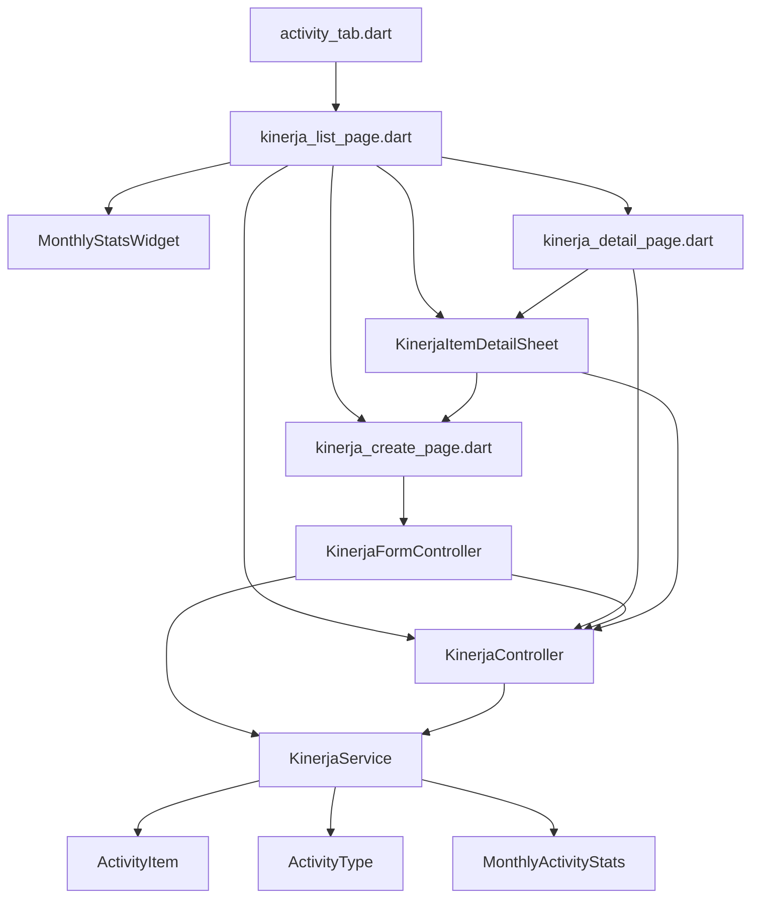

# Rencana Redesign Halaman Kinerja

## Ringkasan Perubahan

Redesign halaman Kinerja sesuai permintaan user:
1. **Halaman Utama Kinerja** — stats + 3 hari terakhir (edit/hapus) + tombol "Lihat Selengkapnya"
2. **Halaman Selengkapnya** (full page) — timeline bulan kiri + grouped list kanan + lazy load pagination
3. **Bottom Sheet Detail Item** — lampiran + info + aksi edit/hapus
4. **Dukungan Edit** — KinerjaCreatePage + KinerjaFormController mode edit

---

## File-by-File Changes

### 1. `lib/features/kinerja/data/models/activity_item.dart`

**Perubahan:** Perluas `copyWith()` untuk mendukung edit semua field.

```dart
// Sebelum:
ActivityItem copyWith({String? imageUrl}) => ...

// Sesudah:
ActivityItem copyWith({
  String? typeId,
  String? typeName,
  String? description,
  DateTime? date,
  String? imageUrl,
}) => ...
```

---

### 2. `lib/features/kinerja/data/services/kinerja_service.dart`

**Perubahan pada abstract class:**

```dart
abstract class KinerjaService {
  // Method existing
  Future<List<ActivityType>> fetchTypes();
  Future<List<ActivityItem>> fetchActivities({
    required int month,
    required int year,
    int page = 1,           // ← TAMBAH
    int pageSize = 20,      // ← TAMBAH
  });
  Future<MonthlyActivityStats> fetchMonthlyStats({...});
  Future<ActivityItem> createActivity({...});

  // Method BARU:
  Future<ActivityItem> updateActivity({
    required String id,
    required String typeId,
    required String description,
    String? imagePath,
  });
  Future<void> deleteActivity(String id);
}
```

**Perubahan pada MockKinerjaService:**
- `fetchActivities()` — tambah parameter `page` dan `pageSize`, filter & paginate dari `_activities`
- `updateActivity()` — cari item by id, update fields, return item yang diupdate
- `deleteActivity()` — hapus item by id dari `_activities`

---

### 3. `lib/features/kinerja/presentation/controllers/kinerja_controller.dart`

**State baru:**

```dart
// Pagination untuk full page detail
final allActivities = <ActivityItem>[].obs;  // full list per month
final currentDetailMonth = DateTime.now().month.obs;
final currentDetailYear = DateTime.now().year.obs;
final page = 1.obs;
final hasMore = true.obs;
final isLoadingMore = false.obs;
```

**Method baru:**

| Method | Fungsi |
|--------|--------|
| `loadMoreActivities()` | Load halaman berikutnya, append ke `allActivities`, update `hasMore` |
| `resetPagination()` | Reset page=1, hasMore=true, kosongkan allActivities |
| `changeDetailMonth(int month)` | Ganti bulan di halaman detail, reset pagination, reload |
| `deleteActivity(String id)` | Panggil service.deleteActivity, hapus dari activities & allActivities, refresh stats |
| `updateActivityInList(ActivityItem updated)` | Ganti item di activities & allActivities dengan yang diupdate |
| `navigateToDetailPage()` | Navigasi ke KinerjaDetailPage |

**Penyesuaian `groupedByDate`** — gunakan `allActivities` (bukan `activities`) untuk halaman detail.

**Hapus/tak perlu:** `last3DaysActivities` tetap relevan (gunakan `activities`).

---

### 4. `lib/features/kinerja/presentation/pages/kinerja_list_page.dart` (REWRITE)

**Halaman Utama Kinerja — struktur baru:**

```
Scaffold
├── AppTopAppBar (title: 'Kinerja')
├── Body: Obx
│   ├── Loading → AppSkeleton
│   ├── Error → error state
│   └── RefreshIndicator → SingleChildScrollView
│       ├── MonthlyStatsWidget (stats)  ← REUSE existing widget
│       ├── SizedBox h12
│       ├── "3 Hari Terakhir" header
│       ├── List 3-day cards (editable & deletable)
│       │   └── _ActivityCard3Day (MODIFIED)
│       │       ├── Icon + type name + date
│       │       ├── Description
│       │       ├── Image thumbnail (if any)
│       │       └── Row: [Edit btn] [Delete btn] [Lihat Detail btn]
│       ├── SizedBox h16
│       └── AppButton "Lihat Selengkapnya" → navigasi ke KinerjaDetailPage
└── FAB → navigasi ke KinerjaCreatePage (create mode)
```

**Detail perubahan:**

| Item | Deskripsi |
|------|-----------|
| Header AppBar | Hapus icon calendar (endDrawer dihapus) |
| EndDrawer | HAPUS — `KinerjaDetailDrawer` tidak digunakan lagi dari sini |
| _ActivityCard3Day | Tambah tombol Edit dan Hapus di card |
| _showDetailSheet | Ganti dari `_ActivityDetailSheet` → `KinerjaItemDetailSheet` (reusable) |
| Bottom section | Tambah `AppButton` "Lihat Selengkapnya" → `Get.to(KinerjaDetailPage)` |
| Import | Hapus `kinerja_detail_drawer.dart`, tambah `kinerja_detail_page.dart` |

**Aksi Edit:** `_navigateToEdit(ActivityItem item)` → `Get.to(() => KinerjaCreatePage(item: item))`
**Aksi Hapus:** `_confirmDelete(ActivityItem item)` → confirm dialog → `controller.deleteActivity(item.id)`

---

### 5. `lib/features/kinerja/presentation/pages/kinerja_detail_page.dart` (REWRITE)

**Halaman Selengkapnya — full page (bukan drawer):**

Layout adaptasi dari `kinerja_detail_drawer.dart`:

```
Scaffold
├── AppTopAppBar (title: 'Detail Kinerja', withBack)
├── Body: Row
│   ├── Timeline Bulanan (kiri) — SAME sebagai drawer
│   │   └── SizedBox(56.w) + ListView vertical
│   │       └── Bulan 1..current, dot+line, label, tap → changeDetailMonth
│   ├── Divider vertikal (1px)
│   └── Expanded (kanan)
│       └── Obx → ListView with ScrollController
│           ├── Selected month info header
│           ├── Grouped by date (allActivities)
│           │   └── Date header + _DetailPageActivityCard
│           └── Loading indicator if isLoadingMore
```

**Perbedaan dengan Drawer:**

| Aspek | Drawer (lama) | Full Page (baru) |
|-------|---------------|------------------|
| Widget | `Drawer` wrapper | `Scaffold` |
| Close | `Navigator.pop()` | AppBar back button |
| Bulan | `changeMonth()` → update `selectedMonth` (sama dengan main page) | `changeDetailMonth()` → dedicated state, tidak mempengaruhi main page |
| Data | `activities` (sama dengan main page) | `allActivities` (dedicated, dengan pagination) |
| Scroll | `ListView` biasa | `ListView` + `ScrollController` + load more |
| Klik item | Tidak ada aksi | → `KinerjaItemDetailSheet` |

**Lazy Load Pagination:**
```dart
final scrollCtrl = ScrollController();

void _onScroll() {
  if (scrollCtrl.position.pixels >= scrollCtrl.position.maxScrollExtent - 200) {
    if (!controller.isLoadingMore.value && controller.hasMore.value) {
      controller.loadMoreActivities();
    }
  }
}
```

**`_DetailPageActivityCard`** — card untuk halaman detail (sama seperti `_DrawerActivityCard` dari drawer, tapi dengan `GestureDetector` untuk tap → bottom sheet).

---

### 6. `lib/features/kinerja/presentation/pages/widgets/kinerja_item_detail_sheet.dart` (NEW)

**Bottom Sheet Detail Item — reusable widget:**

```dart
class KinerjaItemDetailSheet extends StatelessWidget {
  final ActivityItem item;
  // ...
}
```

**Layout:**
```
DraggableScrollableSheet
├── Drag handle
├── Image (if has imageUrl) — full width, contain, max 200.h
├── SizedBox h16
├── Row: icon type + typeName + date
├── SizedBox h16
├── "Deskripsi" label + description text
├── SizedBox h12
├── "Dibuat" timestamp
├── SizedBox h24
└── Row: [Edit button] [Delete button]
    ├── Edit → Get.to(KinerjaCreatePage(item: item))
    └── Delete → confirm → controller.deleteActivity(item.id)
```

**Aksi setelah delete:** `Get.back()` (tutup sheet) + snackbar.

---

### 7. `lib/features/kinerja/presentation/pages/kinerja_create_page.dart` (MODIFY)

**Tambah parameter opsional:**

```dart
class KinerjaCreatePage extends StatelessWidget {
  final ActivityItem? item;  // null = create mode, not null = edit mode
  const KinerjaCreatePage({super.key, this.item});
}
```

**Perubahan UI:**

| Aspek | Create Mode | Edit Mode |
|-------|-------------|-----------|
| AppBar title | 'Buat Kinerja' | 'Edit Kinerja' |
| Tombol submit | 'Simpan Kinerja' | 'Simpan Perubahan' |
| Pre-filled | Kosong | type, description, image dari item |

---

### 8. `lib/features/kinerja/presentation/controllers/kinerja_form_controller.dart` (MODIFY)

**Tambah method dan state untuk edit mode:**

```dart
class KinerjaFormController extends GetxController {
  // State existing — tetap

  // State BARU:
  final editingItem = Rx<ActivityItem?>(null);
  final isEditMode = false.obs;

  // Method BARU:
  void loadFromItem(ActivityItem item) { ... }  // Pre-fill form untuk edit
  Future<void> submit() async {
    if (isEditMode.value) {
      // panggil _service.updateActivity()
      // controller.updateActivityInList(updated)
    } else {
      // existing create logic
    }
  }
}
```

---

### 9. Hapus/Arsipkan File Tidak Dipakai

| File | Status |
|------|--------|
| `lib/features/kinerja/presentation/pages/kinerja_detail_drawer.dart` | HAPUS — fungsinya pindah ke `kinerja_detail_page.dart` |
| `lib/features/kinerja/presentation/pages/kinerja_detail_page.dart` | REWRITE total |
| `lib/features/kinerja/presentation/pages/widgets/activity_card.dart` | CEK apakah masih dipakai — jika tidak, HAPUS |

---

## Dependency Graph



## Urutan Implementasi

1. **ActivityItem** — perluas `copyWith()`
2. **KinerjaService** — tambah `updateActivity()`, `deleteActivity()`, pagination params
3. **KinerjaController** — tambah state & method baru
4. **KinerjaItemDetailSheet** — buat widget baru
5. **KinerjaListPage** — rewrite dengan stats, edit/hapus, "Lihat Selengkapnya"
6. **KinerjaDetailPage** — rewrite sebagai full page dengan timeline + pagination
7. **KinerjaFormController** — tambah edit mode
8. **KinerjaCreatePage** — tambah parameter item, mode edit
9. **Bersihkan** — hapus file tidak dipakai
10. **Validasi** — `flutter analyze`
