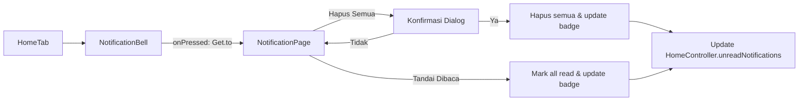
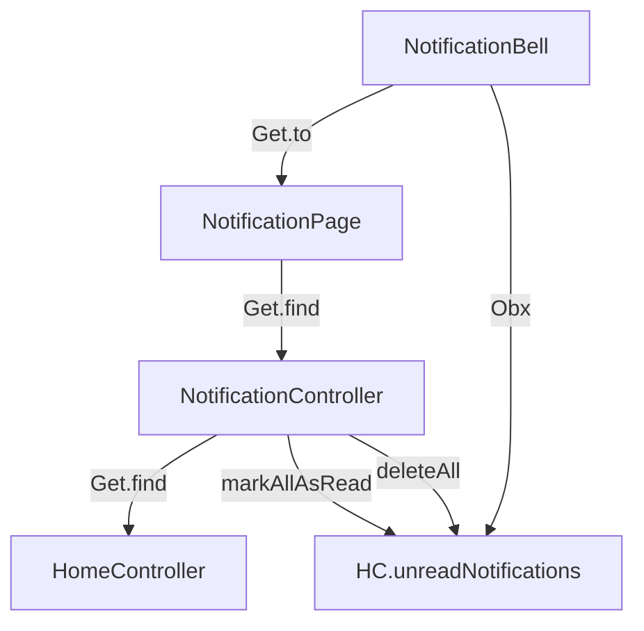

# Rencana: Halaman Notifikasi

## Ringkasan

Membuat halaman notifikasi lengkap yang dapat diakses dari icon bell di halaman utama. Halaman ini menampilkan daftar notifikasi dengan kemampuan menghapus semua dan menandai semua sebagai sudah dibaca.

## Arsitektur

### 1. Model Data — `lib/features/home/data/models/notification_item.dart`

**File baru** di folder data/models karena mengikuti pola arsitektur yang sudah ada.

```dart
class NotificationItem {
  final String id;
  final String title;
  final String body;
  final DateTime createdAt;
  final bool isRead;
  final String type; // Contoh: 'attendance', 'submission', 'system'

  // copyWith, toJson, fromJson jika diperlukan
}
```

### 2. Controller — `lib/features/home/presentation/controllers/notification_controller.dart`

**File baru** mengikuti pola [GetX Controller](lib/features/home/presentation/controllers/home_controller.dart:12).

**State:**
- `notifications` — `RxList<NotificationItem>` daftar notifikasi
- `isLoading` — `RxBool` untuk loading state

**Methods:**
- `loadNotifications()` — memuat data notifikasi (mock)
- `markAllAsRead()` — menandai semua notifikasi sebagai dibaca
- `deleteAllNotifications()` — menghapus semua notifikasi
- `get unreadCount` — getter computed dari jumlah notifikasi yang belum dibaca

**Integrasi dengan [HomeController](lib/features/home/presentation/controllers/home_controller.dart:21):**
- `NotificationController` akan menggunakan `Get.find<HomeController>()` untuk menyinkronkan `unreadNotifications.value`
- Ketika `markAllAsRead()` dipanggil, update juga `homeController.unreadNotifications.value = 0`
- Ketika `deleteAllNotifications()` dipanggil, update juga `homeController.unreadNotifications.value = 0`

### 3. Halaman — `lib/features/home/presentation/pages/notification_page.dart`

**File baru** — halaman stateless dengan struktur:

**AppBar:**
- Title: "Notifikasi"
- Leading: Tombol back otomatis
- Actions: Dua tombol di pojok kanan
  - Tombol "Hapus Semua" (icon: `delete_sweep_outlined` atau `delete_outline`) — dengan konfirmasi dialog
  - Tombol "Tandai Dibaca Semua" (icon: `done_all`) — tanpa konfirmasi

**Body:**
- Menggunakan [Obx](lib/features/home/presentation/widgets/notification_bell.dart:15) dari GetX untuk reactive UI
- **Loading state**: [CircularProgressIndicator](https://api.flutter.dev/flutter/widgets/CircularProgressIndicator-class.html)
- **Empty state**: Icon + teks "Belum ada notifikasi"
- **List state**: [ListView.separated](https://api.flutter.dev/flutter/widgets/ListView/ListView.separated.html) dengan:
  - Setiap item notifikasi berupa Card/Container dengan:
    - Indikator dot hijau untuk notifikasi belum dibaca
    - Title (bold jika belum dibaca)
    - Body (sedikit lebih kecil)
    - Timestamp relatif (misal "2 jam lalu")
  - `Dismissible` untuk swipe-to-delete per-item (opsional)

### 4. Update Navigation — `lib/features/home/presentation/widgets/notification_bell.dart`

**Modifikasi** pada `onPressed` di baris 22-24:
```dart
onPressed: () {
  Get.to(() => const NotificationPage());
},
```

## Alur Navigasi



## Dependency & Alur Data



## Desain Mockup (Konseptual)

```
+----------------------------------+
|  <  Notifikasi      [A][B]       |
+----------------------------------+
|                                   |
|  ● Anda telah check-in pukul     |
|    07:30                           |
|    2 jam lalu                     |
|  ─────────────────────────────    |
|  ○ Pengajuan cuti Anda telah     |
|    disetujui                       |
|    5 jam lalu                     |
|  ─────────────────────────────    |
|  ○ Jadwal presesi besok: Pagi    |
|    07:30 - 16:00                  |
|    1 hari lalu                    |
|  ─────────────────────────────    |
|  ● TPP bulan April telah          |
|    dirilis                         |
|    3 hari lalu                    |
|  ─────────────────────────────    |
|  ○ ...                            |
|                                   |
+----------------------------------+

Keterangan:
[A] = Hapus Semua (icon: delete_sweep)
[B] = Tandai Dibaca Semua (icon: done_all)
●  = Belum dibaca (dengan dot indikator)
○  = Sudah dibaca
```

## File yang Akan Dibuat

| No | File | Keterangan |
|----|------|------------|
| 1 | `lib/features/home/data/models/notification_item.dart` | Model data notifikasi |
| 2 | `lib/features/home/presentation/controllers/notification_controller.dart` | Controller notifikasi |
| 3 | `lib/features/home/presentation/pages/notification_page.dart` | Halaman notifikasi |

## File yang Akan Dimodifikasi

| No | File | Perubahan |
|----|------|-----------|
| 1 | `lib/features/home/presentation/widgets/notification_bell.dart` | Tambahkan navigasi `Get.to(() => const NotificationPage())` |

## Detail Implementasi

### NotificationItem Model

```dart
class NotificationItem {
  final String id;
  final String title;
  final String body;
  final DateTime createdAt;
  final bool isRead;
  final String type;

  const NotificationItem({
    required this.id,
    required this.title,
    required this.body,
    required this.createdAt,
    this.isRead = false,
    this.type = 'system',
  });

  NotificationItem copyWith({bool? isRead}) {
    return NotificationItem(
      id: id,
      title: title,
      body: body,
      createdAt: createdAt,
      isRead: isRead ?? this.isRead,
      type: type,
    );
  }
}
```

### NotificationController

- Gunakan `Get.find<HomeController>()` di `onInit()` atau langsung
- Method `markAllAsRead()`: iterasi semua notifikasi set isRead=true, update HomeController
- Method `deleteAllNotifications()`: kosongkan list, update HomeController
- Method `loadNotifications()`: isi dengan data mock (5-7 notifikasi sample)

### NotificationPage

- Gunakan `GetBuilder` atau `Obx` untuk reactive UI
- Tombol "Hapus Semua" munculkan dialog konfirmasi menggunakan `AppDialog.confirm` (lihat pola di [home_controller.dart baris 166-178](lib/features/home/presentation/controllers/home_controller.dart:166))
- Tombol "Tandai Dibaca" langsung eksekusi tanpa konfirmasi
- Format timestamp relatif menggunakan helper sederhana (tanpa package tambahan)
- Empty state: center alignment dengan icon `notifications_off_outlined`
