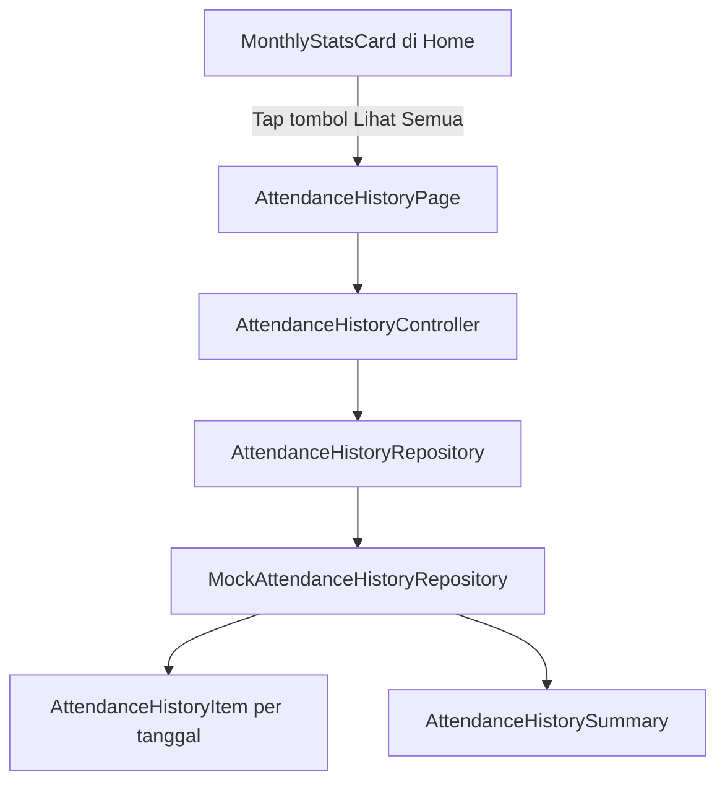

# Rencana Implementasi Halaman List Presensi

## 1. Ringkasan

Membangun fitur **List Presensi** yang terhubung dari section **Kehadiran Bulanan** di halaman home. Halaman ini menampilkan tanggal **1 sampai hari terakhir bulan terpilih** dalam **tahun berjalan** saja, dengan penanda status presensi per tanggal, legend status, dan ringkasan **pie chart**.

> **Konteks tahun berjalan:** menggunakan `DateTime.now().year` sebagai sumber kebenaran. Pada environment saat ini berarti **tahun 2026**.

> **Sumber data:** tetap lewat service/repository API layer, tetapi sementara mengembalikan **mock data** agar pola arsitektur tetap siap saat API nyata tersedia.

---

## 2. Target Perubahan

### 2.1 Area yang disentuh

```text
lib/features/home/
lib/features/presensi/
lib/core/di/
plans/
```

### 2.2 File yang kemungkinan ditambah

```text
lib/features/presensi/data/models/attendance_history_item.dart
lib/features/presensi/data/models/attendance_history_summary.dart
lib/features/presensi/data/repositories/attendance_history_repository.dart
lib/features/presensi/presentation/controllers/attendance_history_controller.dart
lib/features/presensi/presentation/pages/attendance_history_page.dart
lib/features/presensi/presentation/widgets/attendance_month_switcher.dart
lib/features/presensi/presentation/widgets/attendance_day_tile.dart
lib/features/presensi/presentation/widgets/attendance_status_legend.dart
lib/features/presensi/presentation/widgets/attendance_summary_pie_chart.dart
```

### 2.3 File yang diubah

```text
lib/features/home/presentation/widgets/monthly_stats_card.dart
lib/core/di/app_bindings.dart
```

Jika nanti dipilih pendekatan route bernama, maka file routing atau entry point home juga ikut disentuh. Dari struktur saat ini, navigasi paling sederhana tetap bisa memakai `Get.to(...)` langsung dari card home.

---

## 3. Arsitektur yang Disarankan

### 3.1 Pola

Mengikuti pola yang sudah ada di project:

- `data/models` untuk entity response/mock
- `data/repositories` untuk abstraksi akses data
- `presentation/controllers` untuk state layar
- `presentation/pages + widgets` untuk UI

### 3.2 Alur data



### 3.3 Kenapa dipisah dari `HomeController`

- `HomeController` sekarang hanya memuat ringkasan home
- kebutuhan list presensi punya state sendiri: bulan aktif, loading, daftar tanggal, summary, dan validasi tombol `prev/next`
- pemisahan ini menjaga home tetap ringan dan tidak tercampur concern halaman detail

---

## 4. Data Model

### 4.1 Enum status presensi

Perlu enum khusus agar pewarnaan, label, dan summary tidak tersebar di banyak tempat:

```dart
enum AttendanceDayStatus {
  present,
  absent,
  weekend,
  holiday,
  noSchedule,
  permission,
  leave,
}
```

### 4.2 Model item harian

```dart
class AttendanceHistoryItem {
  final DateTime date;
  final AttendanceDayStatus status;
  final String label;
  final String? checkInTime;
  final String? checkOutTime;
  final String? note;
}
```

Catatan:

- `label` dipakai untuk teks tampilan bila dibutuhkan
- `checkInTime/checkOutTime` disiapkan dari awal walau layout awal fokus ke marker tanggal
- `note` berguna untuk libur nasional atau alasan izin/cuti

### 4.3 Model summary bulanan

```dart
class AttendanceHistorySummary {
  final int month;
  final int year;
  final Map<AttendanceDayStatus, int> totals;
}
```

Summary ini menjadi satu sumber untuk:

- total legend bila nanti ingin ditampilkan angka
- data pie chart
- sinkron dengan daftar tanggal yang sedang aktif

---

## 5. Repository dan Mock API

### 5.1 Kontrak repository

```dart
abstract class AttendanceHistoryRepository {
  Future<List<AttendanceHistoryItem>> fetchMonthlyHistory({
    required int month,
    required int year,
  });

  Future<AttendanceHistorySummary> fetchMonthlySummary({
    required int month,
    required int year,
  });
}
```

### 5.2 Implementasi mock

Gunakan pola yang sama dengan `MockPresensiRepository` dan `MockKinerjaService`:

- delay `600-800ms`
- data dibentuk berdasarkan bulan dan tahun
- tetap lewat repository, bukan hardcode di controller

### 5.3 Strategi mock data

Untuk setiap tanggal dalam bulan terpilih:

- `Sabtu/Minggu` otomatis `weekend`
- beberapa tanggal ditandai `holiday`
- beberapa tanggal kerja diisi variasi `present`, `absent`, `permission`, `leave`, `noSchedule`

Prioritas penentuan status:

1. `holiday`
2. `weekend`
3. `noSchedule`
4. status riwayat kerja aktual: `present`, `absent`, `permission`, `leave`

Ini penting agar tanggal libur nasional yang jatuh di weekday tidak tertimpa status lain.

### 5.4 Catatan integrasi DI

`app_bindings.dart` perlu menambahkan:

```dart
Get.put<AttendanceHistoryRepository>(
  MockAttendanceHistoryRepository(),
  permanent: true,
);
```

Controller halaman dapat dibuat lazy di page binding lokal atau diinisialisasi saat page dibuka.

---

## 6. Perubahan di Halaman Home

### 6.1 Titik integrasi

Widget yang paling tepat diubah adalah:

- `lib/features/home/presentation/widgets/monthly_stats_card.dart`

### 6.2 Tambahan UX

Pada header card **Kehadiran Bulanan**, tambahkan tombol aksi seperti:

- `Lihat Semua`
- atau ikon panah `chevron_right`

Rekomendasi:

- gunakan `TextButton.icon` kecil di sisi kanan header
- tetap mengikuti `AppTypography.labelMedium` dan warna `colors.primary`

### 6.3 Perilaku navigasi

Saat ditekan:

```dart
Get.to(() => const AttendanceHistoryPage());
```

Jika ingin state bulan awal sama dengan ringkasan home, bulan default di halaman list adalah bulan saat ini.

---

## 7. Desain Halaman List Presensi

### 7.1 Struktur layout

Urutan konten halaman:

1. `AppBar` dengan title `List Presensi`
2. card/filter bulan dengan tombol `prev` dan `next`
3. daftar tanggal dari `1` sampai akhir bulan
4. legend status
5. pie chart ringkasan

### 7.2 Bulan navigator

Komponen `AttendanceMonthSwitcher` memuat:

- tombol `prev`
- label bulan aktif, misalnya `Mei 2026`
- tombol `next`

Aturan:

- tahun fix ke `DateTime.now().year`
- `prev` disable saat bulan aktif `Januari`
- `next` disable saat bulan aktif `Desember`

Dengan begitu user tetap bisa pindah bulan, tapi hanya dalam konteks **1 Januari 2026 sampai 31 Desember 2026** pada environment saat ini.

### 7.3 Daftar tanggal

Layout yang disarankan:

- gunakan `ListView.separated`
- satu item mewakili satu tanggal
- setiap item menampilkan:
  - nama hari
  - angka tanggal
  - nama bulan singkat bila perlu
  - badge/status text kecil

Contoh struktur visual:

```text
[ Rab ] [ 01 ] [ Hadir ]
[ Kam ] [ 02 ] [ Hadir ]
[ Jum ] [ 03 ] [ Izin ]
```

### 7.4 Marker status pada tanggal

Permintaan user menyebut marker berupa **background dan border** mengikuti status. Maka tiap tile tanggal sebaiknya punya:

- warna background lembut
- border 1px
- warna teks menyesuaikan status

Mapping awal yang konsisten dengan design system:

- `present` -> `colors.success`
- `absent` -> `colors.error`
- `permission` -> `colors.warning`
- `leave` -> `colors.primary`
- `weekend` -> `colors.outline`
- `holiday` -> `colors.secondary`
- `noSchedule` -> `colors.outline` dengan opacity berbeda dari `weekend`

Untuk `holiday` dan `noSchedule`, cukup gunakan turunan warna yang sudah ada, tidak perlu menambah token warna baru kecuali setelah review visual ternyata tidak cukup kontras.

### 7.5 Legend

Legend ditempatkan di bawah list tanggal dalam bentuk wrap chips kecil:

- Hadir
- Alpha
- Weekend
- Libur
- Tidak Ada Jadwal
- Izin
- Cuti

Setiap item legend menampilkan:

- dot atau kotak warna
- label status

Gunakan `Wrap` agar responsif di mobile.

### 7.6 Pie chart

Karena `pubspec.yaml` saat ini belum memuat package chart, ada 2 opsi:

1. Rekomendasi: buat `CustomPainter` pie chart sederhana di `attendance_summary_pie_chart.dart`
2. Alternatif: tambah dependency `fl_chart`

Rekomendasi saya: **pakai `CustomPainter`** untuk pie chart statis sederhana, karena:

- tidak menambah dependency
- scope kecil
- cukup untuk mock summary presensi

Konten chart:

- slice berdasarkan total status bulan aktif
- label angka total di tengah atau di bawah chart
- warna wajib sama dengan legend

---

## 8. Controller Halaman

### 8.1 State utama

`AttendanceHistoryController` minimal memiliki:

```dart
final selectedMonth = DateTime.now().month.obs;
final selectedYear = DateTime.now().year.obs;
final items = <AttendanceHistoryItem>[].obs;
final summary = Rx<AttendanceHistorySummary?>(null);
final isLoading = false.obs;
final errorMessage = Rx<String?>(null);
```

### 8.2 Method utama

```dart
Future<void> loadMonth();
Future<void> goToPrevMonth();
Future<void> goToNextMonth();
bool get canGoPrev;
bool get canGoNext;
```

### 8.3 Perilaku

- `onInit()` memanggil `loadMonth()`
- saat pindah bulan, controller memuat ulang `items` dan `summary`
- daftar tanggal selalu dibangun penuh dari tanggal `1` sampai `lastDayOfMonth`

### 8.4 Generasi tanggal penuh

Walaupun API mock mengembalikan riwayat, controller sebaiknya tetap memastikan semua tanggal dalam bulan ada di UI:

1. generate seluruh tanggal dalam bulan aktif
2. cocokkan dengan map hasil repository
3. isi gap tanggal dengan status default yang sesuai, misalnya `weekend` atau `noSchedule`

Keuntungan:

- UI selalu konsisten penuh satu bulan
- saat API nyata nanti hanya tanggal tertentu dikirim pun halaman tetap aman

---

## 9. Styling dan Design System

### 9.1 Token yang wajib dipakai

Mengikuti design system yang sudah ada:

- `AppColors`
- `AppTypography`
- `AppSpacing`
- `AppRadius`
- `AppCard`

### 9.2 Aturan penerapan

- container utama gunakan `AppCard` untuk section bulan, legend, dan chart
- padding dominan `s12`, `s16`
- jarak antar section `s8` atau `s12`
- title section gunakan `titleMedium`
- label kecil gunakan `bodySmall` atau `labelMedium`

### 9.3 Konsistensi visual

- hindari warna custom di luar turunan DS bila belum perlu
- hindari hardcoded font size
- gunakan `ScreenUtil` seperti halaman home yang sudah ada
- gunakan opacity untuk versi background status, bukan warna baru acak

---

## 10. Langkah Implementasi Bertahap

### Tahap 1 - Fondasi data

1. Buat enum status presensi
2. Buat model item harian
3. Buat model summary bulanan
4. Buat repository + mock repository
5. Daftarkan repository di `AppBindings`

### Tahap 2 - State management

1. Buat `AttendanceHistoryController`
2. Tambahkan logika bulan aktif
3. Tambahkan loader/error state
4. Tambahkan generator tanggal penuh satu bulan

### Tahap 3 - UI halaman list presensi

1. Buat `AttendanceHistoryPage`
2. Buat widget switcher bulan
3. Buat tile tanggal dengan status background/border
4. Buat legend status
5. Buat pie chart summary

### Tahap 4 - Integrasi home

1. Update `MonthlyStatsCard`
2. Tambahkan tombol navigasi ke halaman list presensi
3. Uji alur dari home ke halaman list

### Tahap 5 - Validasi

1. Uji Januari dan Desember
2. Uji bulan 28, 29, 30, 31 hari
3. Uji data kosong
4. Uji kombinasi status penuh
5. Uji konsistensi warna legend vs tile vs chart

---

## 11. Edge Case yang Harus Ditangani

- bulan Februari tahun kabisat dan non-kabisat
- status `holiday` yang jatuh pada weekday
- status `weekend` yang tidak boleh dihitung sebagai alpha
- bulan tanpa data API eksplisit tetap harus menampilkan semua tanggal
- tombol `prev/next` tidak boleh keluar dari tahun berjalan
- jumlah summary harus sinkron dengan jumlah tile tanggal

---

## 12. Risiko Teknis

### 12.1 Risiko visual

`holiday`, `weekend`, dan `noSchedule` bisa terlihat terlalu mirip jika hanya memakai `outline`.

Mitigasi:

- bedakan opacity background
- bedakan style border, misalnya `holiday` lebih menonjol dari `weekend`

### 12.2 Risiko kompleksitas chart

Jika pie chart dibuat terlalu interaktif, `CustomPainter` akan memakan waktu lebih banyak.

Mitigasi:

- fase awal cukup chart statis non-interaktif
- tooltip/animasi bisa ditunda

### 12.3 Risiko duplikasi mapping status

Jika warna/label status ditulis di banyak file, rawan tidak sinkron.

Mitigasi:

- buat helper/extension tunggal untuk `AttendanceDayStatus`
- pusatkan mapping label dan warna di satu file

---

## 13. Hasil Akhir yang Diharapkan

Setelah implementasi:

- user bisa membuka **List Presensi** dari card **Kehadiran Bulanan** di home
- user bisa melihat semua tanggal dalam bulan aktif
- user bisa pindah bulan dengan `prev/next` dalam batas **tahun berjalan**
- tiap tanggal memiliki marker visual berdasarkan status presensi
- tersedia legend yang konsisten dengan marker
- tersedia pie chart ringkasan status presensi
- seluruh UI tetap mengikuti design system project
- data sudah lewat service/repository mock, sehingga mudah diganti ke API nyata

---

## 14. Rekomendasi Implementasi

Rekomendasi final untuk scope pertama:

- gunakan **page baru** terpisah, jangan modal/bottom sheet
- gunakan **repository mock** baru, jangan hardcode di widget
- gunakan **CustomPainter** untuk pie chart agar tidak menambah dependency
- pusatkan mapping status ke helper tunggal agar legend, tile, dan chart selalu sinkron
